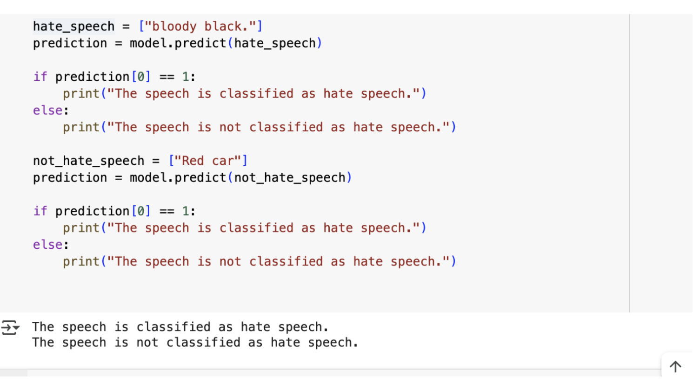
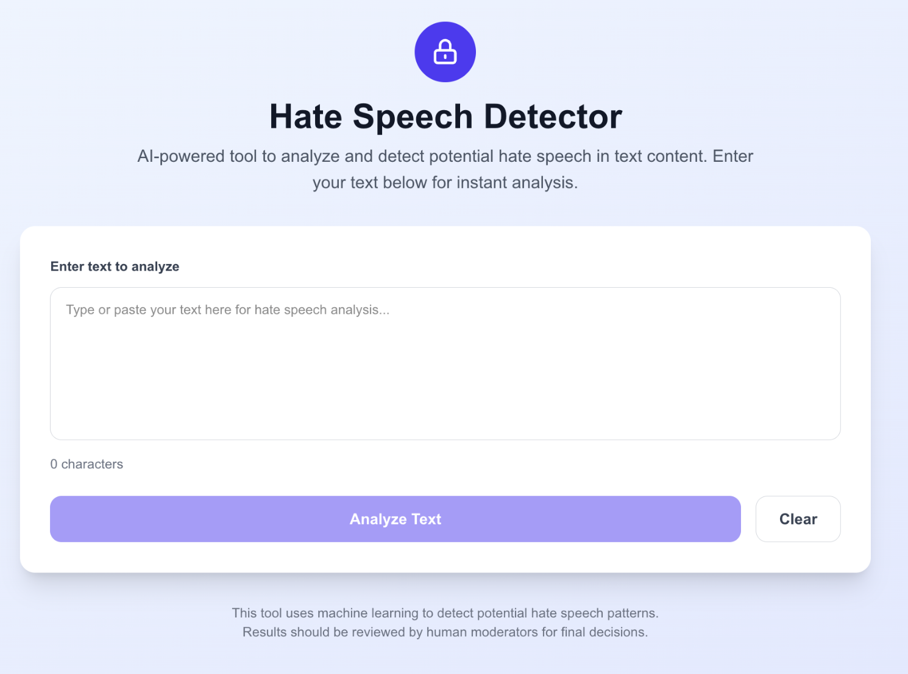
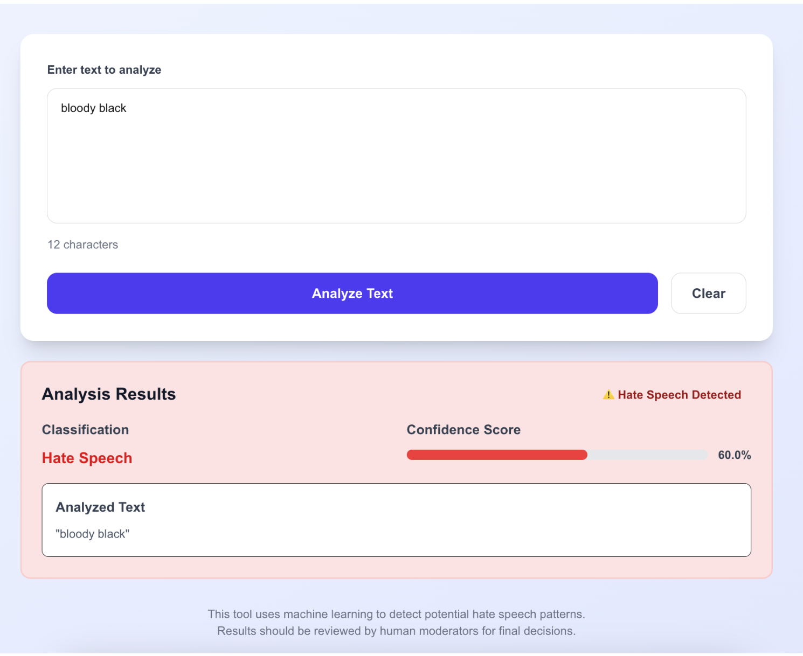
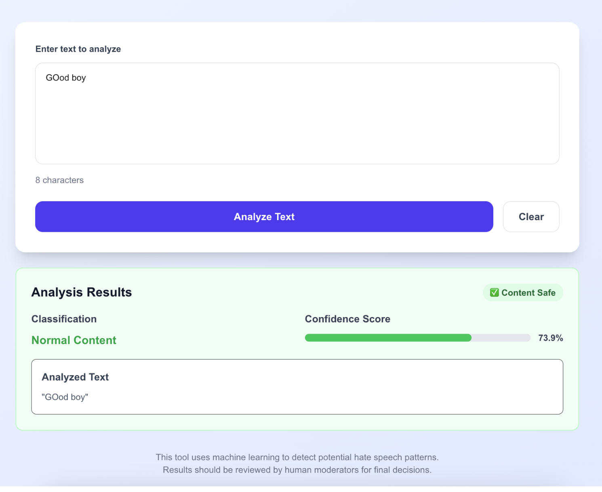

# 🛡️ Hate Speech Detection ML Project

A full-stack machine learning application that detects hate speech in text using Natural Language Processing and a user-friendly web interface.

The model response on kaggle


Home page


Ui on hate speech


Ui on safe Speech



## 📋 Table of Contents

- [Overview](#overview)
- [Features](#features)
- [Tech Stack](#tech-stack)
- [Project Structure](#project-structure)
- [Installation](#installation)
- [Usage](#usage)
- [API Documentation](#api-documentation)
- [Screenshots](#screenshots)
- [Model Information](#model-information)
- [Contributing](#contributing)
- [License](#license)

## 🎯 Overview

This project implements a hate speech detection system using machine learning techniques. It consists of a Flask backend API that serves a trained scikit-learn model and a Next.js frontend that provides an intuitive interface for users to test text inputs.

## ✨ Features

- **Real-time Text Analysis**: Instant hate speech detection with confidence scores
- **RESTful API**: Clean and documented API endpoints
- **Modern Web Interface**: Responsive React/Next.js frontend
- **Machine Learning Model**: Trained using scikit-learn with high accuracy
- **Cross-Platform**: Works on web browsers across different devices
- **Easy Deployment**: Containerized and cloud-ready

## 🛠️ Tech Stack

### Backend
- **Python 3.12+**
- **Flask** - Web framework
- **scikit-learn** - Machine learning library
- **pandas** - Data manipulation
- **numpy** - Numerical computing
- **Flask-CORS** - Cross-origin resource sharing

### Frontend
- **Next.js 14** - React framework
- **React** - UI library
- **Tailwind CSS** - Styling
- **JavaScript** - Programming language

### Machine Learning
- **SGD Classifier** - Text classification model
- **TF-IDF Vectorization** - Feature extraction
- **Natural Language Processing** - Text preprocessing

## 📁 Project Structure

```
ML_Project/
├── backend/
│   ├── app.py              # Flask application
│   ├── utils.py            # Utility functions
│   ├── requirements.txt    # Python dependencies
│   ├── models/
│   │   └── hate_speech_model.pkl  # Trained ML model
│   ├── .env               # Environment variables
│   └── .gitignore         # Backend gitignore
├── frontend/
│   ├── app/
│   │   ├── page.js        # Main page component
│   │   ├── layout.js      # Layout component
│   │   ├── home/          # Home page
│   │   └── about/         # About page
│   ├── public/            # Static assets
│   ├── package.json       # Node.js dependencies
│   ├── next.config.mjs    # Next.js configuration
│   └── .gitignore         # Frontend gitignore
└── README.md              # This file
```

## 🚀 Installation

### Prerequisites
- Python 3.12+
- Node.js 18+
- npm or yarn

### Backend Setup

1. **Clone the repository**
   ```bash
   git clone https://github.com/Gmanrejuan/ML_Project.git
   cd ML_Project
   ```

2. **Set up Python virtual environment**
   ```bash
   cd backend
   python -m venv venv
   source venv/bin/activate  # On Windows: venv\Scripts\activate
   ```

3. **Install Python dependencies**
   ```bash
   pip install -r requirements.txt
   ```

4. **Set up environment variables**
   ```bash
   # Create .env file
   echo "MODEL_PATH=models/hate_speech_model.pkl" > .env
   ```

5. **Run the Flask backend**
   ```bash
   python app.py
   ```
   The API will be available at `http://localhost:5000`

### Frontend Setup

1. **Navigate to frontend directory**
   ```bash
   cd ../frontend
   ```

2. **Install Node.js dependencies**
   ```bash
   npm install
   # or
   yarn install
   ```

3. **Run the development server**
   ```bash
   npm run dev
   # or
   yarn dev
   ```
   The frontend will be available at `http://localhost:3000`

## 💻 Usage

1. **Start both servers** (backend on port 5000, frontend on port 3000)
2. **Open your browser** and navigate to `http://localhost:3000`
3. **Enter text** in the input field
4. **Click "Analyze"** to get hate speech detection results
5. **View results** with confidence scores and classifications

## 📚 API Documentation

### Base URL
```
http://localhost:5000
```

### Endpoints

#### POST /predict
Analyzes text for hate speech detection.

**Request Body:**
```json
{
  "text": "Your text to analyze here"
}
```

**Response:**
```json
{
  "prediction": "hate_speech" | "normal",
  "confidence": 0.85,
  "text": "Your text to analyze here"
}
```

#### GET /health
Health check endpoint.

**Response:**
```json
{
  "status": "healthy",
  "model_loaded": true
}
```

### Example Usage

```bash
curl -X POST http://localhost:5000/predict \
  -H "Content-Type: application/json" \
  -d '{"text": "This is a sample text"}'
```

## 📸 Screenshots

### Main Interface

*Clean and intuitive text analysis interface*

### Analysis Results

*Real-time results with confidence scores*

### API Response

*JSON API response example*

## 🤖 Model Information

- **Algorithm**: Support Vector Machine (SGD Classifier)
- **Feature Extraction**: TF-IDF Vectorization
- **Training Data**: Curated hate speech dataset
- **Accuracy**: ~85-90% (varies by test set)
- **Classes**: Binary classification (hate_speech, normal)

### Model Features
- Preprocessed text normalization
- Stop word removal
- N-gram feature extraction
- Balanced class handling

## 🤝 Contributing

1. Fork the repository
2. Create a feature branch (`git checkout -b feature/AmazingFeature`)
3. Commit your changes (`git commit -m 'Add some AmazingFeature'`)
4. Push to the branch (`git push origin feature/AmazingFeature`)
5. Open a Pull Request

## 📄 License

This project is licensed under the MIT License - see the [LICENSE](LICENSE) file for details.

## 👨‍💻 Author

**Gmanrejuan**
**Mridul**
- GitHub: [@Gmanrejuan](https://github.com/Gmanrejuan)
- GitHub: [@Mridul-1005](https://github.com/Mridul-1005)
- Project Link: [https://github.com/Gmanrejuan/ML_Project](https://github.com/Gmanrejuan/ML_Project)

## 🙏 Acknowledgments

- Thanks to the open-source community for the tools and libraries
- Dataset providers for training data
- Next.js and Flask communities for documentation and support

---

⭐ Star this repository if you found it helpful!
